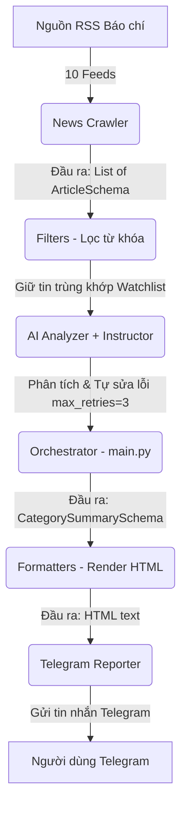

# Kế hoạch Triển khai Stock News Bot (Hiện trạng LIVE của Hệ thống v2.0.0)

Tài liệu này đóng vai trò là **Single Source of Truth (SSOT)**, ghi nhận kiến trúc, cấu trúc dữ liệu và các luồng xử lý đang hoạt động thực tế (Live) của hệ thống Stock News Bot sau đợt nâng cấp kiến trúc v2.0.0.

---

## 1. Kiến trúc Hệ thống & Luồng Dữ liệu (Live)

Kiến trúc v2.0 hoạt động theo mô hình tách biệt trách nhiệm hoàn chỉnh (Separation of Concerns) dưới sự điều phối của Orchestrator (`main.py`):

---

## 2. Data Contract (Quy ước Dữ liệu)

Hệ thống ràng buộc dữ liệu đầu vào và đầu ra qua các lớp dữ liệu Pydantic tại [schemas.py](file:///d:/Nghiên cứu AI/vnstock-agent-guide/stock_news_bot/models/schemas.py):

### 2.1 ArticleSchema (Đầu ra Crawler -> Đầu vào AI Analyzer)
Mỗi bài viết được Crawler đóng gói trực tiếp thành đối tượng `ArticleSchema` thay vì DataFrame:
*   `url` (str): Đường dẫn bài viết (đồng thời là khóa chính trong Cache).
*   `title` (str): Tiêu đề bài viết.
*   `short_description` (str): Tóm tắt ngắn ban đầu.
*   `content` (str): Nội dung bài viết chi tiết.
*   `publish_time` (str): Thời gian xuất bản.
*   `category` (str): Tên danh mục (Vĩ mô Việt Nam / Vĩ mô Thế giới / Kinh tế Ngành / Doanh nghiệp & Đầu tư).

### 2.2 CategorySummarySchema (Đầu ra AI Analyzer -> Đầu vào Formatter)
Được cấu trúc để nhận phản hồi từ Gemini thông qua `instructor`:
*   `category_name` (str): Tên danh mục tin tức.
*   `summary_points` (List[str]): Các điểm tin chính ảnh hưởng tới thị trường/watchlist.
*   `impacts` (List[str]): Đánh giá tác động đến các cổ phiếu trong watchlist.
*   *Business Rules (Validator)*:
    *   `summary_points` không được phép rỗng.
    *   Tất cả các phần tử trong danh sách không được chứa các thẻ HTML tự phát (tránh xung đột parser của Telegram).

### 2.3 ArticleAnalysisSchema (Dành cho việc phân tích bài viết đơn lẻ)
*   `summary` (str): Tóm tắt ngắn gọn các điểm chính.
*   `impact` (str): Đánh giá tác động (Tích cực, Tiêu cực, Trung tính, Không rõ).
*   `sentiment` (str): Đánh giá tâm lý thị trường.
*   `ticker` (Optional[str]): Mã cổ phiếu được nhắc đến (nếu có).
*   `source_url` (str): URL nguồn của bài báo.

---

## 3. Các Cơ chế Bảo vệ & Tối ưu hoạt động (Live)

### 3.1 Cơ chế Lọc kép (Double Filter) cho Ngành & Doanh nghiệp
1.  **Lớp 1 (Lọc thô bằng Code)**: Thực hiện tại [filters.py](file:///d:/Nghiên cứu AI/vnstock-agent-guide/stock_news_bot/utils/filters.py). Lọc các tin tức thuộc danh mục Kinh tế Ngành và Doanh nghiệp & Đầu tư để chỉ giữ lại các tin chứa từ khóa tài chính, chứng khoán hoặc mã cổ phiếu trong watchlist.
2.  **Lớp 2 (AI Filter)**: AI tự đọc nội dung chi tiết bài viết và chỉ tổng hợp hoặc đánh giá tác động đối với các mã cổ phiếu trong watchlist.

### 3.2 Tích hợp Instructor & Vòng lặp Tự sửa lỗi (Self-Correction Loop)
*   Thay vì dùng Regex parse chuỗi JSON lỏng lẻo dễ gãy, bot sử dụng `instructor` để bọc Gemini API Model.
*   Khi Gemini trả về dữ liệu không thỏa mãn các điều kiện validation của Pydantic (ví dụ: chứa thẻ HTML rác, thiếu thông tin bắt buộc), Pydantic sẽ ném ra lỗi.
*   `instructor` tự động bắt lỗi này, đóng gói log lỗi kèm prompt và gửi ngược lại cho Gemini yêu cầu chỉnh sửa (tối đa `max_retries=3`). Nhờ đó, Orchestrator hoàn toàn giải phóng khỏi logic sửa lỗi định dạng.

### 3.3 Cơ chế Xoay vòng API Key & Tránh Spam
*   **Xoay vòng API Key**: AIAnalyzer hỗ trợ danh sách API key dự phòng. Khi gặp lỗi `429 RESOURCE_EXHAUSTED`, bot sẽ tự động chuyển sang key tiếp theo và thử lại chu kỳ ngay lập tức.
*   **Độ trễ requests**: Bot ngủ chờ 2 giây (`time.sleep(2)`) giữa các requests AI để tránh quá tải API (TPM/RPM).

### 3.4 Quản lý trạng thái Cache và Đóng gói
*   **Ghi cache ở khối `finally`**: Việc ghi cache alert trạng thái (`sent_urls`) được thực hiện duy nhất một lần ở khối `finally` của `main.py` khi toàn bộ chu kỳ chạy thành công, đảm bảo tính nguyên tử (atomic).
*   **Ghi nhận Subagent Metrics**: Mọi request AI thành công hay thất bại đều được log thông tin thời gian chạy, số lần retry và mã lỗi chi tiết dưới dạng JSON Lines vào file `logs/agent_metrics.jsonl` để theo dõi sức khỏe Subagent.
